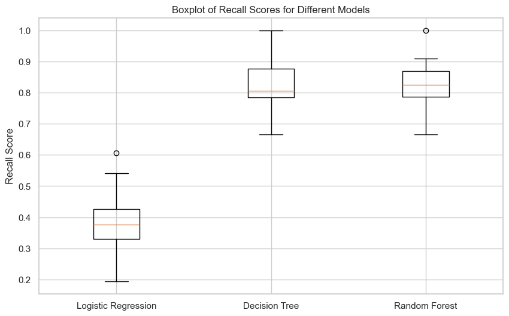

# 📊 Project Title: Python Customer Churn Prediction Model  
Author: Alvin Nguyễn – Nguyễn Thế Đạt  
Date: April 2025  
Tools Used: Python, Pandas, Scikit-learn

---

## 📑 Table of Contents  
1. [📌 Background & Overview](#-background--overview)  
2. [📂 Dataset Description & Structure](#-dataset-description--structure)  
3. [⚒️ Main Process](#️-main-process)  
4. [🔎 Final Conclusion & Recommendations](#-final-conclusion--recommendations)

## 📌 Background & Overview  

### 🎯 Objective:
The goal of this project is to **build a predictive machine learning model to identify customers likely to churn**, allowing the business to proactively implement retention strategies.

### ❓ Business Question:
- What are the key behavioral and service factors that lead to customer churn?
- How can we predict which customers are at risk and reduce attrition rate?

### 👤 Who is this project for?
✔️ Customer Success & Retention Teams  
✔️ Data Analysts at Subscription-based businesses  
✔️ Marketing Teams planning retention campaigns  

## 📂 Dataset Description & Structure  

### 📌 Data Source:
- Source: Public telecom dataset (or company CRM exports)  
- Size: ~6,600 rows × ~20 columns  
- Format: `.csv`

### 📊 Key Variables:
| Column Name       | Data Type | Description                                 |
|------------------|-----------|---------------------------------------------|
| customerID        | Text      | Unique identifier for each customer         |
| tenure            | Integer   | Number of months customer has stayed        |
| MonthlyCharges    | Float     | Monthly payment amount                      |
| DaySinceLastOrder | Integer   | Days since last order                       |
| CashbackAmount    | Float     | Total cashback received                     |
| Churn             | Boolean   | Whether the customer left (1) or stayed (0) |

## ⚒️ Main Process

1️⃣ **Data Cleaning & Preprocessing**  
- Removed duplicates and filled missing values using `SimpleImputer` with median strategy. 
- Applied `pd.get_dummies` for categorical variables  
- Scaled numerical features for modeling

2️⃣ **Feature Selection**  
- Used a `Decision Tree Classifier` for feature selection.  
- Identified `DaySinceLastOrder`, `Tenure`, `Complain`, `NumberOfAddress`, and `CashbackAmount` as key predictors

3️⃣ **Visualization and Data Exploration**
- Customer churn-rate versus Complain tags

- **Observation**: The churn rate for customers who complained (31.7%) is significantly higher than for those who did not complain (10.9%). 
- **Recommendation**: To reduce churn, focus on addressing customer complaints more effectively and improving the overall customer service experience.

- Important Features Distribution and Relationship

- **Observation**: 
    - Customers tend to churn within the first year. (This accounts for over 65% of the total churn in the dataset).
    - In addition to frequent transactions, cashback amount also plays a role in retaining customers and reducing churn.
- **Recommendation**:
    - Focus on taking care of new customers to reduce churn in the first year.
    - Regularly engage with customers and remind them to make repeat purchases, thereby reducing churn.
    - Diversify cashback programs and other promotional offers, such as anniversary programs one year after the first transaction.

---

4️⃣ **Model Building & Evaluation**  
- We implemented and evaluated three machine learning models:
  1. **Logistic Regression**: Predicted churn based on linear relationships between features.
  2. **Decision Tree**: A non-linear model that helped capture complex interactions between features.
  3. **Random Forest**: An ensemble model that provided the best generalization and accuracy on test data.
  
  **Evaluation Metrics**: We used cross-validation and tuned hyperparameters using **GridSearchCV**.
- The boxplot illustrates the recall scores for three different machine learning models: **Logistic Regression**, **Decision Tree**, and **Random Forest**.

## 🔎 Final Conclusion & Recommendations

### 📌 Key Takeaways:
- **Random Forest** performed the best across all models, achieving a **0.960** test accuracy when using feature-selected data.
- **Decision Tree** was a close competitor, showing stable performance but with slightly lower test accuracy compared to Random Forest.
- **Logistic Regression** was the least effective, particularly on feature-selected data, due to its linear nature, which failed to capture complex relationships in the data.

### ✅ Business Recommendations:
1. **Prioritize Random Forest for churn prediction**: Given its strong performance, **Random Forest** should be the go-to model for predicting high-risk customers.
2. **Improve Logistic Regression**: The performance of Logistic Regression can be enhanced by further feature engineering or by trying other regularization techniques.
3. **Focus on high-complaint customers**: Customers who complain frequently are at a high risk of churn. Targeting them with personalized retention strategies (such as offering discounts or better customer service) could reduce churn significantly.
4. **Long-tenure customers**: Customers with a high tenure are less likely to churn. Focus retention efforts on newer customers with lower tenure who might be at risk of leaving.
5. **Monitor Cashback Usage**: Customers using cashback programs seem to show higher retention rates. Expanding cashback or loyalty programs could boost customer retention.

---
