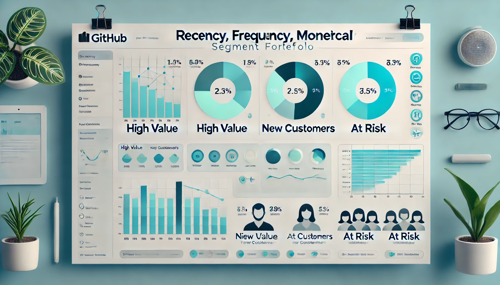

# 📊 Project Title: RFM Segmentation for Customer Behavior Insight & Marketing Strategy  
Author: Alvin Nguyễn – Nguyễn Thế Đạt  
Date: 2025-04-10  
Tools Used: Power BI, Power Query, DAX

## 📑 Table of Contents  
1. [📌 Background & Overview](#-background--overview)  
2. [📂 Dataset & Segmentation Summary](#-dataset--segmentation-summary)  
3. [⚒️ Main Process](#️-main-process)  
4. [🔎 Key Insights & Business Recommendations](#-key-insights--business-recommendations)

## 📌 Background & Overview  

### 🎯 Objective:
This project aims to segment a customer base of 19,820 users using **RFM (Recency, Frequency, Monetary)** analysis. The goal is to **understand customer behavior** and provide **tailored strategies** to increase retention, optimize campaigns, and improve customer lifetime value.

### ❓ Business Questions:
- Which customer groups contribute most to revenue and frequency?
- Which segments are at risk or can be reactivated for growth?
- How can we design personalized actions for different customer types?

### 👤 Who is this project for?
✔️ CRM & Loyalty Program Teams  
✔️ Marketing Analysts & Growth Strategists  
✔️ Business Stakeholders & Decision Makers  

## 📂 Dataset & Segmentation Summary

- 📄 **Data Source**: Retail transaction database (19,820 customers)  
- 🧩 **Segmentation Logic**: RFM scoring using quintiles (Q1–Q5)  
- 🧮 **Segments Created**: 10 groups including *Champions*, *Loyal*, *At Risk*, *Lost*, *Need Attention*, etc.  
- 📊 **Dashboard View Includes**:
  - RFM Score Distribution
  - Segment-wise revenue and transaction volume
  - Top customers and top categories
  - Strategic recommendations for each segment

## ⚒️ Main Process

1️⃣ **Data Cleaning & Preparation**  
- Filtered UK-based transactions  
- Removed cancelled invoices and outliers (e.g., negative price)  
- Created a new Revenue column (`Quantity * Price`)  

2️⃣ **RFM Score Calculation**  
- Used **Power Query** for data prep and **DAX** to calculate Recency, Frequency, and Monetary values  
- Scored each customer across RFM dimensions using **quintile binning**  
- Mapped combined RFM scores into defined customer segments  

3️⃣ **Dashboard Design (Power BI)**  
- Built visuals to explore:  
  - Segment popularity  
  - Revenue vs. last year  
  - Frequency by segment  
  - Top customer & product contributors  

## 🔎 Key Insights & Business Recommendations

### 📌 Key Takeaways:
✔️ **Champions** contribute the most revenue ($75M), with the highest frequency (973 transactions)  
✔️ **At Risk** and **Cannot Lose Them** segments show high revenue potential if reactivated  
✔️ Segments like **Hibernating**, **Lost**, and **About To Sleep** need engagement strategies  

### ✅ Business Recommendations:
- **Maintain engagement** with *Champions*, *Loyal*, and *Need Attention* segments using early access & loyalty perks  
- **Re-activate* *At Risk*, *Hibernating*, and *Cannot Lose Them* segments with personalized "come-back" promotions  
- **Promote onboarding campaigns** for *New* and *Promising* customers to improve retention and frequency  
- **Run surveys or exit analysis** for *Lost* customers to prevent future churn

## 📁 Repository Structure

- `RFM_Segmentation.pbix`: Power BI dashboard file  
- `README.md`: Project documentation  
- Source data & PDFs available upon request

