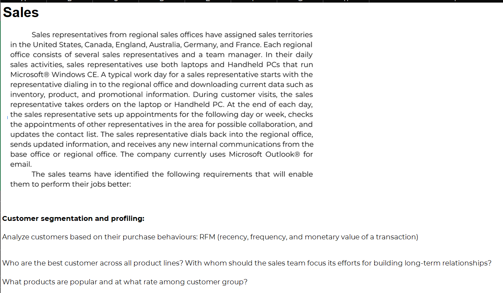

# 📊 Project Title: RFM Segmentation for Customer Behavior Insight & Marketing Strategy  
Author: Alvin Nguyễn – Nguyễn Thế Đạt  
Date: 2025-04-10  
Tools Used: Power BI, Google Bigquery, Power Query, DAX


---

## 📁 Table of Contents  
1. [📌 Background & Overview](#background--overview)  
2. [📂 Dataset Description & Data Structure](#dataset-description--data-structure)  
3. [⚒️ Main Process](#main-process)  
4. [📊 Key Insights & Visualizations](#key-insights--visualizations)  
5. [🔎 Final Conclusion & Recommendations](#final-conclusion--recommendations)  

---

## 📌 Background & Overview

### 📖 What is this project about?  
Sales representatives across regional offices in the US, Canada, UK, Australia, Germany, and France face challenges understanding product performance, customer segmentation, and inventory optimization. The lack of unified visibility makes it difficult to align marketing efforts, predict sales performance, and support long-term customer relationships.



### ❓ Business Questions:
- How can we segment customers based on their purchase behaviors (recency, frequency, and monetary value)?
- Who are the best customers across all product lines?
- Which products are most popular and at what rates across different customer groups?

### 🎯 Project Outcome:
- Active dashboard showcases sales trends by product, customer, and geography.
- RFM-based segmentation has been implemented.
- Key metrics including revenue, frequency, and product popularity have been visualized to support sales strategy.
- Products with negative gross profit were explored. Either data entry contains price errors or the business is selling below cost. Stakeholders are advised to verify data integrity or pricing policy.

### 📌 Why We Use RFM for This Project

- The RFM (Recency – Frequency – Monetary) model is a proven method for evaluating customer value based on purchasing behavior. In this project, RFM was chosen to help sales teams:

  - Segment customers into meaningful behavioral groups (e.g., Loyal, At Risk, Champions)

  - Prioritize outreach by identifying high-value and high-risk segments

  - Support targeted campaigns based on customer lifecycle and engagement patterns

  - By focusing on how recently (Recency), how often (Frequency), and how much (Monetary) a customer has purchased, RFM allows the team to shift from generic sales efforts to data-driven, personalized strategy.

- 📊 How We Use the Quintile Method for RFM Score
  - To calculate RFM scores, we apply the quintile method, which ranks customers into 5 equal groups (from 1 to 5) for each metric:

  - Recency Value = DATEDIFF(LastTransDate, DATE(2014,7,1), DAY)

    → Lower value = more recent → higher R-score

  - Frequency Value = COUNT(SalesOrderHeader[CustomerID])
  
    → Higher count = more frequent purchases → higher F-score

  - Monetary Value = SUM(SalesTable[LineTotal])
  
    → Higher spending = more valuable → higher M-score

  - Each customer receives a score from 1 (low) to 5 (high) for R, F, and M based on percentile ranking. These three scores are combined into an RFM composite score, which is then mapped to customer segments like “Champions,” “Promising,” or “At Risk.”

  - This scoring approach ensures objectivity, scalability, and allows comparison across a large customer base with ease.

---

## 📂 Dataset Description & Data Structure

### 📌 Data Source  
- Google BigQuery Public Dataset: [AdventureWorks2019 Sales](https://console.cloud.google.com/bigquery?ws=!1m4!1m3!3m2!1sadventureworks2019!2sSales)

### 📊 Data Structure & Relationships

#### 1️⃣ Tables Used:
- Fact tables: `SalesOrderHeader`, `SalesTable`
- Dimension tables: `DimDate`, `Customer`, `Product.Product`, `Sales.Product`, `SalesPerson`, `Person`, `RFM Tables`, `Score_Segment`

#### 2️⃣ Table Schema & Sample Description
*(Click to expand each table)*


<details>
<summary>Table: Product.Product</summary>

| Column Name          | Description           |
|----------------------|-----------------------|
| ProductID            | Product identifier    |
| Name                 | Product name          |
| Color                | Product color         |
| ProductNumber        | Product SKU           |
| StandardCost         | Cost to produce/buy   |
| ListPrice            | Listed retail price   |
| Size                 | Product size          |
| Weight               | Product weight        |

</details>

<details>
<summary>Table: Sales.Product</summary>

| Column Name          | Description                   |
|----------------------|-------------------------------|
| ProductID            | FK to Product.Product         |
| Category             | High-level product grouping   |
| Subcategory          | Detailed classification       |
| ProductCategoryID    | ID of category                |
| ProductSubcategoryID | ID of subcategory             |

</details>

<details>
<summary>Table: SalesOrderHeader</summary>

| Column Name    | Description                 |
|----------------|-----------------------------|
| SalesOrderID   | Sales order ID              |
| OrderDate      | Date of order               |
| ShipDate       | Date shipped                |
| CustomerID     | FK to Customer              |
| TotalDue       | Final billed amount         |

</details>

<details>
<summary>Table: SalesTable</summary>

| Column Name    | Description                 |
|----------------|-----------------------------|
| SalesOrderID   | FK to SalesOrderHeader      |
| ProductID      | FK to Product               |
| OrderQty       | Quantity ordered            |
| LineTotal      | Line total for item         |
| UnitPrice      | Price per item              |
| StandardCost   | Product cost                |

</details>

<details>
<summary>Table: Customer</summary>

| Column Name    | Description                   |
|----------------|-------------------------------|
| CustomerID     | Unique customer ID            |
| AccountNumber  | Account number                |
| TerritoryID    | Linked sales region           |

</details>

<details>
<summary>Table: DimDate</summary>

| Column Name     | Description          |
|-----------------|----------------------|
| Date            | Calendar date        |
| Year            | Calendar year        |
| Quarter         | Quarter number       |
| Month           | Month number         |
| Day Name        | Name of the day      |
| Week of Year    | Week number          |

</details>

<details>
<summary>Table: RFM Tables</summary>

| Column Name      | Description                        |
|------------------|------------------------------------|
| CustomerID       | Unique customer ID                 |
| Frequency Value  | Number of orders                   |
| Monetary Value   | Total purchase value               |
| Recency Value    | Days since last transaction        |
| F-Score/R-Score  | Quintile-based rank per metric     |
| RFM Score        | Combined behavioral score          |

</details>

<details>
<summary>Table: Score_Segment</summary>

| Column Name | Description              |
|-------------|--------------------------|
| Scores      | Composite RFM Score      |
| Segment     | Customer segment label   |

</details>

---

#### 3️⃣ Data Relationships:


---

## 🧠 Design Thinking Process  

1️⃣ Empathize  


➡️ Applied 5W1H to define the problem


2️⃣ Define NorthStar Metric


➡️ Define Point of View


3️⃣ Ideate 


---

## ⚒️ Main Process

### 1. Connect Google BigQuery to Power BI
- Connected to `adventureworks2019.Sales` dataset via BigQuery connector.

### 2. Review the data and perform EDA
- Checked nulls, duplicates, and inconsistencies.
- Identified products with negative gross profit — suggesting possible data errors or pricing issues.

### 3. Apply Power DAX code to create Calendar table

```DAX
DimDate = 
var _fromYear=YEAR(MIN(SalesOrderHeader[OrderDate]))
var _toYear=2015   
var _startOfFiscalYear=4 
var _today=TODAY()
return
ADDCOLUMNS(
    CALENDAR(DATE(_fromYear,1,1), DATE(_toYear,12,31)),
    "Year", YEAR([Date]),
    "Start of Year", DATE(YEAR([Date]),1,1),
    "End of Year", DATE(YEAR([Date]),12,31),
    "Month", MONTH([Date]),
    "Start of Month", DATE(YEAR([Date]), MONTH([Date]), 1),
    "End of Month", EOMONTH([Date],0),
    "Days in Month", DATEDIFF(DATE(YEAR([Date]), MONTH([Date]), 1), EOMONTH([Date],0), DAY)+1,
    "Year Month Number", INT(FORMAT([Date],"YYYYMM")),
    "Year Month Name", FORMAT([Date],"YYYY-MMM"),
    "Day", DAY([Date]),
    "Day Name", FORMAT([Date],"DDDD"),
    "Day Name Short", FORMAT([Date],"DDD"),
    "Day of Week", WEEKDAY([Date]),
    "Day of Year", DATEDIFF(DATE(YEAR([Date]),1,1), [Date], DAY)+1,
    "Month Name", FORMAT([Date],"MMMM"),
    "Month Name Short", FORMAT([Date],"MMM"),
    "Quarter", QUARTER([Date]),
    "Quarter Name", "Q"&FORMAT([Date],"Q"),
    "Year Quarter Number", INT(FORMAT([Date],"YYYYQ")),
    "Year Quarter Name", FORMAT([Date],"YYYY")&" Q"&FORMAT([Date],"Q"),
    "Start of Quarter", DATE(YEAR([Date]), (QUARTER([Date])*3)-2, 1),
    "End of Quarter", EOMONTH(DATE(YEAR([Date]), QUARTER([Date])*3, 1),0),
    "Week of Year", WEEKNUM([Date]),
    "Start of Week", [Date]-WEEKDAY([Date])+1,
    "End of Week", [Date]+7-WEEKDAY([Date]),
    "Fiscal Year", IF(_startOfFiscalYear=1,YEAR([Date]),YEAR([Date])+QUOTIENT(MONTH([Date])+(13-_startOfFiscalYear),13)),
    "Fiscal Quarter", QUARTER(DATE(YEAR([Date]), MOD(MONTH([Date])+(13-_startOfFiscalYear)-1,12)+1, 1)),
    "Fiscal Month", MOD(MONTH([Date])+(13-_startOfFiscalYear)-1,12)+1,
    "Day Offset", DATEDIFF(_today,[Date],DAY),
    "Month Offset", DATEDIFF(_today,[Date],MONTH),
    "Quarter Offset", DATEDIFF(_today,[Date],QUARTER),
    "Year Offset", DATEDIFF(_today,[Date],YEAR),
    "Day Number", DAY([Date])
)
```

### 4. Apply DAX to create metrics and RFM segment logic

| Measure Name         | Description                                      |
|----------------------|--------------------------------------------------|
| Total Revenue        | SUM(SalesTable[LineTotal])                      |
| Avg Order Value      | AVERAGE(SalesOrderHeader[TotalDue])             |
| Order Count          | COUNT(SalesOrderHeader[SalesOrderID])           |
| Recency Value        | DATEDIFF(LastTransDate, DATE(2014,7,1), DAY)    |
| Frequency Value      | COUNT(SalesOrderHeader[CustomerID])             |
| Monetary Value       | SUM(SalesTable[LineTotal])                      |
| RFM Score            | Combine F, R, M scores (quintile method)        |
| Popular Product Count| COUNT of orders per product                     |

---

## 📊 Key Insights & Visualizations

### 🔍 Dashboard 1: Sales Summary 
*(Click **Detail** to expand Observations & Recommendation)*


<details>
<summary>Detail</summary>

- **Observation**: The customer base is segmented into 11 categories using RFM analysis. 'New Customers' (17.02%) and 'Promising' (12.95%) are the most represented, while 'Need Attention' forms a small but potentially recoverable group (1.38%). The segmentation allows targeted attention based on loyalty and behavior.

- **Recommendation**: Prioritize marketing campaigns for 'Promising' and 'Potential Loyalist' segments to push them into 'Loyal' or 'Champions'. Design win-back strategies for 'At Risk' and 'Lost Customers' with personalized offers and improved service outreach.

</details>

---
### 🔍 Dashboard 2: RFM Segmentation
*(Click **Detail** to expand Observations & Recommendation)*


<details>
<summary>Detail</summary>

- **Observation**: 

  - Champions hold the highest total spend ($75M) but have a declining growth rate of only 19.5% YoY, suggesting market saturation or a lack of continued engagement.

  - At Risk customers have the highest profit ($2.83M) and decent spending ($7.8M) but also show long inactivity (average 269 days since last order). This segment offers great potential if properly re-engaged.

  - Promising and Loyal customers exhibit healthy activity but have significantly lower average spending ($416 and $815 respectively), indicating untapped revenue potential.

  - Segment-specific product affinity shows most segments are heavily concentrated in Road Bikes and Mountain Bikes. Notably, “About to Sleep” customers have 74% of their purchases in Road Frames – a narrow interest range.
- **Recommendation**: 
  - Launch win-back campaigns tailored for the At Risk segment, offering exclusive discounts or reactivation perks before churn deepens.

  - Enhance personalized upselling strategies for the Promising and Loyal segments to increase their average transaction value.

  - For Champions, consider loyalty rewards or early access to new products to reignite growth and avoid erosion.

  - Review product diversity offerings for segments with narrow subcategory focus (e.g. “About to Sleep” and “Need Attention”) to create new bundles and cross-sell opportunities.

</details>


### 🔍 Dashboard 3: Product Performance
*(Click **Detail** to expand Observations & Recommendation)*


<details>
<summary>Detail</summary>

- **Observation**: 
  - A significant portion of products are incurring negative gross profit, particularly in Road and Touring Bike subcategories. Items like “Road-650 Red, 44” show losses over $150K with margins as low as -16.29%, suggesting either data entry issues or unsustainable pricing.

  - The scatter plot highlights a large red zone of loss-making SKUs—even some high-revenue items fall into this category, compounding financial inefficiency.

  - Despite overall revenue growth driven by the Bikes category, profitability remains thin due to the wide range of loss-leading SKUs.

  - Products like “Mountain-200 Black” and “Mountain-200 Silver” are consistently generating multi-segment top-line revenue, indicating strong cross-segment demand.

- **Recommendation**: 
  - 🚨 Conduct an immediate pricing and cost validation audit for the most negative-margin products. Prioritize resolving issues with Road and Touring models before financial leakage grows.

  - 📉 Consider discontinuing or renegotiating sourcing of SKUs with persistent losses and low recovery potential.

  - 📊 Double down on high-performing Mountain series bikes, which show consistent performance across segments (Champions, At Risk, Loyal), by ensuring stock availability and featuring them in promotions.

  - 📦 Implement a category-level profit monitoring dashboard to prevent unnoticed revenue-growth masking profitability decline.

</details>

---


## 🔎 Final Conclusion & Recommendations

- The Power BI analysis provided powerful visibility into both customer segmentation and product profitability, equipping decision-makers with a dual-lens perspective to drive action.

- From a customer segmentation standpoint, while the company benefits from a broad base of “Champions” and “Loyal” customers, it faces **missed opportunities in “Promising,” “At Risk,” and “Potential Loyalist” groups—segments** that hold high value but show signs of stagnation or disengagement. The behavioral variance across segments indicates a need for **targeted strategies, not one-size-fits-all campaigns**.

- On the product performance side, the presence of **high-revenue** but **loss-generating** SKUs is a critical red flag. While the Bikes category propels revenue growth, deeper analysis reveals severe profitability concerns in the Road and Touring product lines. The **cost-revenue imbalance** in many SKUs—despite appearing strong in sales—compromises overall financial health.

- These findings suggest that growth alone is not sufficient—sustainability requires profitable growth. Moving forward, strategic focus should aim to retain high-value customers, revive at-risk relationships, and optimize product-level margins through informed pruning and prioritization.

### Recommended Actions:

**🎯 Customer Strategy:**

- Prioritize re-engagement of 'At Risk' and 'Promising' customers through personalized promotions and retargeting efforts.

- Launch exclusive loyalty programs for “Champions” to maintain their engagement and prevent defection.

- Use RFM metrics to build lifecycle-specific campaigns, matching customer behavior with relevant content or offers.

**📈 Product Strategy:**

- Audit and address SKUs with negative gross profit, especially in Road and Touring categories.

- Reprice, replace, or retire consistently underperforming products that cannot justify their place in the portfolio.

- Boost inventory, marketing, and bundling efforts around top performers like the “Mountain-200” series, which show strong cross-segment appeal.

**📊 Process & Monitoring**

- Set up automated alerts for products slipping into negative margin territory.

- Conduct monthly profitability reviews tied to both product and customer segment performance.

- Encourage cross-functional collaboration between sales, marketing, and operations to balance growth with sustainability.

---