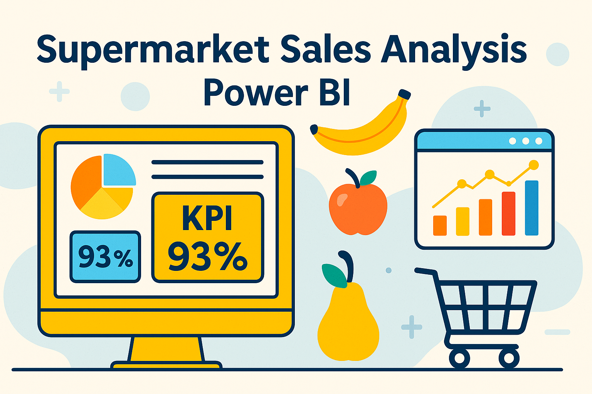

# 🛒 Supermarket Sales Analysis Dashboard and Presentation Insight

**Author**: Alvin Nguyễn – Nguyễn Thế Đạt  
**Date**: April 10, 2025  
**Tools Used**: Power BI, Power Query, DAX

## 📌 Project Overview

This project involves developing an interactive **Power BI dashboard** to analyze supermarket sales data. The goal is to uncover actionable insights to enhance sales performance and identify opportunities for regional expansion.

---

## 🎯 Business Questions and Objectives

- **Which products contribute most significantly to total sales?**
- **What are the sales trends across different regions and time periods?**
- **Are there specific customer segments driving higher revenue?**
- **How can the supermarket optimize inventory and marketing strategies to boost sales?**

## 👥 Target Audience

- **Sales and Marketing Teams** seeking data-driven strategies to increase revenue.
- **Regional Managers** aiming to identify high-performing areas and potential markets for expansion.
- **Inventory Management Teams** looking to optimize stock levels based on sales trends.

## 📂 Dataset Description

The analysis utilizes the **Contoso Sales Dataset**, which includes:

- **Transactions**: Detailed sales records with product, customer, and regional information.
- **Products**: Data on product categories, subcategories, and individual items.
- **Customers**: Demographic and regional information about the customer base.

## ⚙️ Analysis Process

1. **Data Exploration and Cleaning**:  
   - Imported datasets into Power BI.
   - Cleaned and transformed data using **Power Query** to handle missing values and ensure consistency.

2. **Data Modeling**:  
   - Established relationships between tables to create a robust data model.
   - Defined calculated columns and measures using **DAX** for key performance indicators (KPIs).

3. **Dashboard Development**:  
   - Designed interactive visualizations to represent sales performance across products, regions, and customer segments.
   - Incorporated filters and slicers to enable dynamic data exploration.

4. **Presentation of Insights**:  
   - Compiled findings into a comprehensive presentation, highlighting key insights and strategic recommendations.

## 🔍 Key Insights and Business Recommendations

- **Top-Performing Products**:  
  - Identified products with the highest sales volume and revenue.
  - **Recommendation**: Focus marketing efforts on these products and ensure adequate stock levels to meet demand.

- **Regional Sales Performance**:  
  - Analyzed sales distribution across different regions.
  - **Recommendation**: Allocate resources to high-performing regions and investigate factors contributing to lower sales in underperforming areas.

- **Customer Segmentation**:  
  - Segmented customers based on purchasing behavior and demographics.
  - **Recommendation**: Develop targeted marketing campaigns tailored to the preferences of each segment to enhance customer engagement and loyalty.

- **Seasonal Sales Trends**:  
  - Observed fluctuations in sales during specific time periods.
  - **Recommendation**: Plan promotions and inventory stocking in anticipation of peak sales periods to maximize revenue.

## 📁 Repository Structure

- `DAR.pbix`: Power BI dashboard file containing the data model and visualizations.
- `Contoso sale analysis.pptx`: Presentation detailing the analysis process, insights, and recommendations.
- `Data Dictionary.xlsx`: Documentation of dataset fields and descriptions.
- `Data Exploration.pbix`: Power BI file focused on the exploratory data analysis phase.
- `README.md`: Project documentation (this file).
