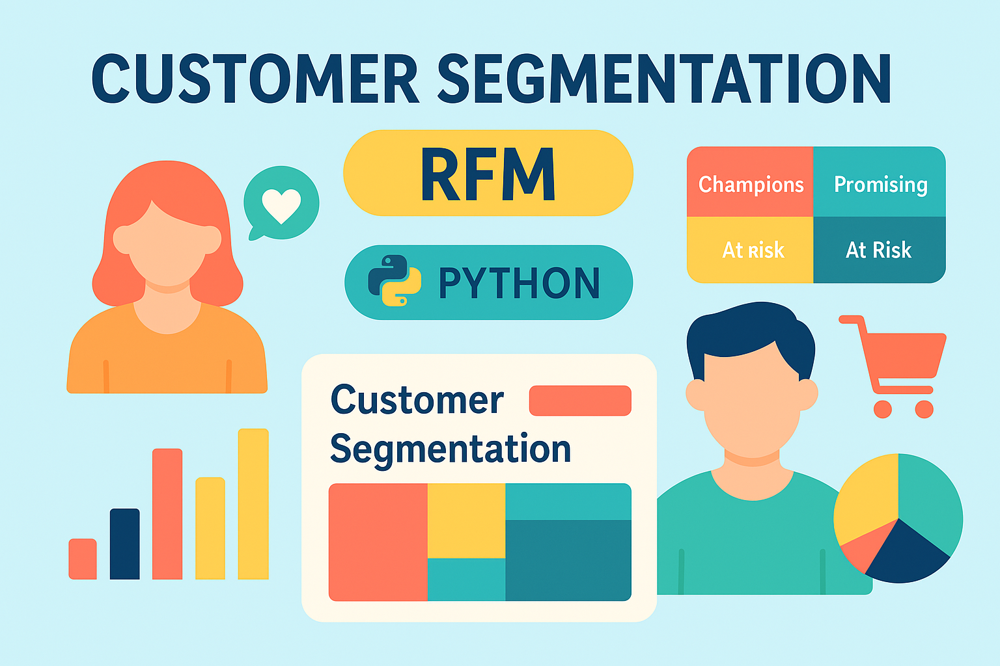

# 📊 Project Title: Customer Segmentation & Purchase Behavior Analysis (Retail - Python)  
Author: Alvin Nguyễn – Nguyễn Thế Đạt  
Date: April 2025  
Tools Used: Python

---

## 📑 Table of Contents  
1. [📌 Background & Objectives](#-background--objectives)  
2. [📂 Dataset Overview](#-dataset-overview)  
3. [⚒️ Analysis Workflow](#️-analysis-workflow)  
4. [🔎 Key Insights & Business Recommendations](#-key-insights--business-recommendations)  

---

## 📌 Background & Objectives  

### 🎯 Objective:
This project aims to segment online retail customers based on **recency**, **frequency**, and **monetary** behavior (RFM analysis). The objective is to provide actionable insights for the business to improve retention and marketing targeting by understanding the most valuable customers and identifying at-risk segments.

### ❓ Business Questions:
- **Who are our most valuable customers?**  
- **Which segments are inactive or at risk?**  
- **What actions can we take to engage each segment better?**

### 👤 Who is this project for?
- CRM & Loyalty Teams
- Marketing & Retargeting Analysts
- Business Intelligence & Growth Strategy Teams

---

## 📂 Dataset Overview  

- **Source**: The dataset contains transactions from a UK-based online retail store.  
- **Volume**: ~300,000 rows across ~20,000 customers  
- **Format**: `.csv`
- **Key Fields**: `InvoiceNo`, `CustomerID`, `Quantity`, `Price`, `Country`, `InvoiceDate`

---

## ⚒️ Analysis Workflow  

1️⃣ **Data Cleaning**  
- Filter out **canceled and defective orders** into a separate subset—these are the rows with **negative quantity** values.

- Remove any records with a **negative unit_price**, as these transactions represent **bad-debt adjustments**.

- Drop duplicate entries, keeping only one instance of each.

- Filter and retain **only transactions from the UK**, since the UK accounts for nearly 89% of the dataset.

- *Shape of original dataset and cleanned dataset*

2️⃣ **Feature Engineering**  
- Created a `Revenue` column (Quantity × Price).  
- Calculated **Recency**, **Frequency**, and **Monetary** for each customer by groupby().  

- Used `qcut()` to segment customers into RFM quintiles and assigned scores.  

- Combined RFM scores into named groups:  
  - *Champions*, *Loyal*, *Potential Loyalist*, *At Risk*, *Lost*, etc.  

4️⃣ **Data Visualization Observations & Recommendations**  

### 1. Segments with High Frequency but Long Recency  
  

- **Observation:** The “Need Attention” segment used to purchase frequently but hasn’t bought in a long time, putting them at high risk of churn.  
- **Recommendation:** Roll out personalized win-back offers and reminders to re-engage this valuable yet slipping group.

---

### 2. Highest to Lowest Frequency by Segment  
  

- **Observation:** “Hibernating customers” and “Loyal” segments drive the most transactions, while “Cannot Lose Them” surprisingly shows low order volume.  
- **Recommendation:** Boost engagement for the “Cannot Lose Them” segment with exclusive promotions to increase their purchase frequency.

---

### 3. Highest to Lowest Monetary by Segment  
  

- **Observation:** “Champions” and “Loyal” customers account for the lion’s share of revenue, whereas “About To Sleep” and “Lost customers” contribute very little.  
- **Recommendation:** Invest in loyalty rewards for top spenders and deploy targeted recovery campaigns for low-revenue segments to maximize ROI.

---

### 4. Distribution of Recency, Frequency & Monetary  
  

- **Observation:** Recency centers around mid-range days, but Frequency and Monetary are heavily right-skewed—few customers are extremely active or high-spending.  
- **Recommendation:** Segment outreach: use broad-appeal promotions for the mass of infrequent buyers and VIP perks for your high-value minority.

---

### 5. RFM Segment by Revenue & Percentage  
  

- **Observation:** The “Champions” segment occupies the largest revenue slice, followed by “Loyal” and “At Risk,” underscoring their importance.  
- **Recommendation:** Prioritize retention programs for Champions and Loyal customers, and launch targeted win-back initiatives for the At Risk group to safeguard revenue.

## 🔎 Key Insights & Business Recommendations

- **“Need Attention” customers** used to buy often but haven’t returned in a while, putting them at high churn risk.  
- **“Hibernating” & “Loyal” segments** account for the most transactions, while **“Cannot Lose Them”** surprisingly under-orders.  
- **“Champions” & “Loyal”** drive the lion’s share of revenue; **“About To Sleep”** and **“Lost”** contribute very little.  
- RFM shows **moderate recency** but **highly skewed frequency & monetary**—a small group of power buyers and a large base of infrequent shoppers.  
- **“Champions,” “Loyal,” and “At Risk”** represent the largest revenue slices, making them critical targets.

### ✅ Business Recommendations

- **Win-back “Need Attention”** with personalized offers and gentle reminders.  
- **Activate “Cannot Lose Them”** via exclusive promotions to boost their order volume.  
- **Reward your top spenders** (Champions & Loyal) with VIP perks, early access, or loyalty tiers.  
- **Segment outreach**: broad-appeal campaigns for infrequent buyers; VIP experiences for high-value customers.  
- **Retain & recover**: run targeted re-engagement for At Risk and Lost segments to safeguard revenue.  
- **Monitor & iterate**: refresh RFM scores monthly and A/B-test messaging by segment to continuously improve ROI.  

