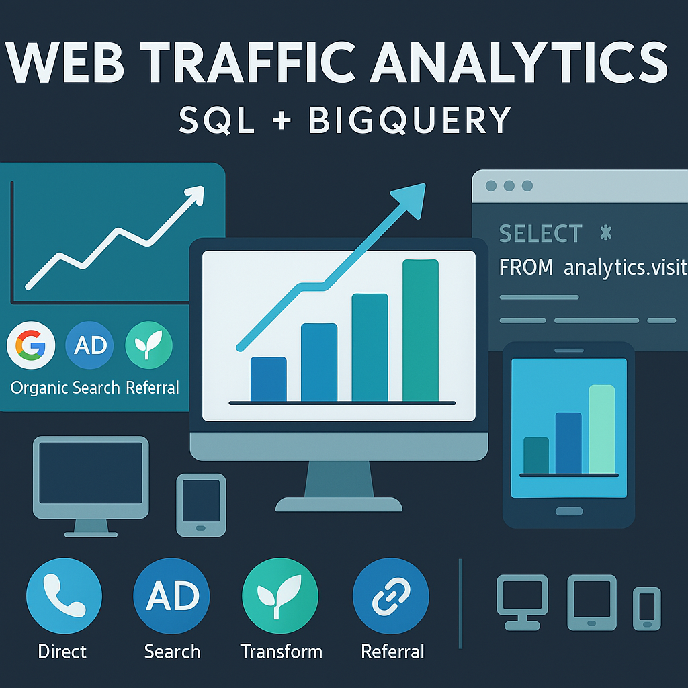

# 📊 Project Title: Web Traffic Analysis Using SQL & Google Analytics Sample Data  
Author: Alvin Nguyễn – Nguyễn Thế Đạt  
Tools Used: SQL, BigQuery

---

## 📑 Table of Contents  
1. [📌 Background & Objective](#-background--objective)  
2. [📂 Dataset & Structure](#-dataset--structure)  
3. [⚒️ Main Process](#️-main-process)  
4. [🔎 Key Insights & Business Recommendations](#-key-insights--business-recommendations)

## 📌 Background & Objective  

### 🎯 Objective:
To explore **user session behavior** from the Google Merchandise Store and generate **marketing and product insights** using SQL queries on BigQuery.

### ❓ Business Questions:
- Which **traffic sources** bring in the most revenue?
- How does **device type** affect session quality and goal completion?
- What are the trends in **bounce rate** and **landing page performance**?

### 👤 Who is this project for?
✔️ Digital Marketing Analysts  
✔️ Web Analytics Teams  
✔️ Data Analysts using SQL for product & customer insight  

## 📂 Dataset & Structure

### 📌 Data Source:
- Source: **Google Analytics Sample Dataset** (hosted in Google BigQuery)  
- Format: SQL (1 main table: `ga_sessions_*`)  
- Volume: Millions of rows in partitioned daily tables

### 📊 Key Tables & Features:
| Table | Description |
|-------|-------------|
| `ga_sessions_*` | User sessions including device, traffic source, transactions, and page views |
| Fields used include: `trafficSource`, `device`, `totals`, `geoNetwork`, `hits`, `transactions` |

## ⚒️ Main Process

1️⃣ **Query Design**  
- Used SQL to aggregate sessions, bounce rates, session duration, and transactions  
- Applied CTEs and window functions for advanced grouping and ranking

2️⃣ **Segmentation by Channel & Device**  
- Analyzed data grouped by traffic source (e.g. Organic, Referral) and device (Desktop, Mobile)

3️⃣ **Performance Metrics**  
- Calculated revenue per session, conversion rate, and goal completions per channel  

## 🔎 Key Insights & Business Recommendations

### 📌 Key Takeaways:
✔️ **Desktop users** drive higher revenue despite fewer sessions than mobile users  
✔️ **Organic Search** is the best-performing traffic channel in conversion  
✔️ **Referral traffic** shows high bounce rates and lower engagement  

### ✅ Recommendations:
- Invest more in **SEO** and **desktop experience optimization**  
- Improve **landing page quality** for referral traffic to reduce bounce rate  
- Use these segmentations for **budget allocation in marketing campaigns**

## 📁 Repository Contents

- `SQL_google_analytics_sample-ga_sessions.sql`: Query logic  
- `README.md`: This file  

